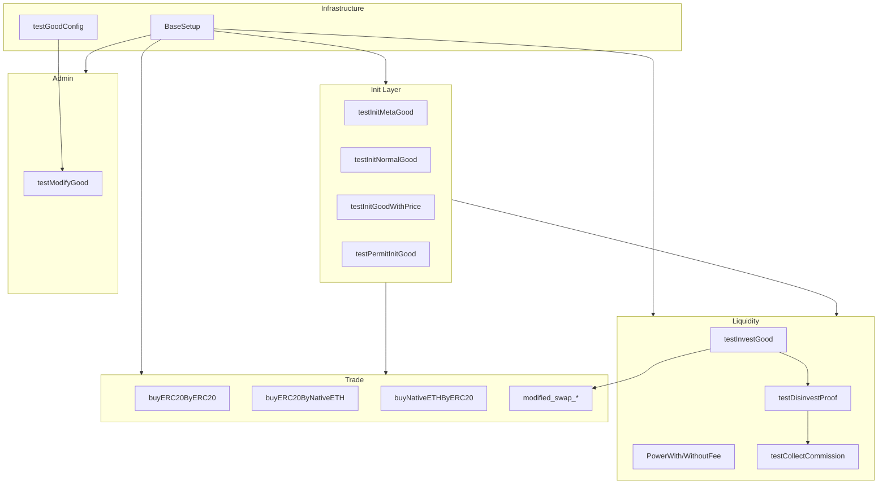

# TTSwap Core — 测试地图 (v2.0)

> 生成基准：`forge test --match-path "test/*"` → **297 passed** / **1 skipped** / **39 suites**  
> 适用范围：`test/` 目录（不含 `testback/`、`releases/`、`lib/`）

---

## 1. 快速导航

| 我要测什么 | 优先看 | 已有文件 |
|-----------|--------|---------|
| 创建商品池 | §4.1 initGood | `testInitMetaGood.t.sol`, `testInitNormalGood.t.sol`, `testInitGoodWithPrice.t.sol`, `testPermitInitMetaGood.t.sol` |
| 加仓 / 杠杆 | §4.2 investGood | `testInvestGood.t.sol`, `PowerWithFee/WithoutFee.t.sol` |
| 撤资 / 佣金分配 | §4.3 disinvestProof | `testDisinvestProof.t.sol`, `testCollectCommission.t.sol` |
| 兑换 | §4.4 buyGood | `buyERC20*.t.sol`, `buyNativeETH*.t.sol`, `modified_swap_*.sol`, `testBuyGoodMetaTx.t.sol` |
| 福利 / 锁定 | §4 admin | `testGoodWelfare.t.sol`, `testModifyGood` (lockGood) |
| 配置修改 | §4.5 modifyGood* | `testModifyGood.t.sol`, `testGoodConfig.sol` |
| 授权转账 | §4.1 permit 路径 | `testPermitInitMetaGood.t.sol` |
| Token 治理 | §6 | `testTTSwapToken.t.sol`, `addbanlist.t.sol`, `addRefer.sol` |

**运行命令**

```bash
# 全量
forge test --match-path "test/*"

# 单套件
forge test --match-contract testInvestGood -vv

# 单用例
forge test --match-test testBuyERC20ByERC20 -vvv
```

---

## 2. v2.0 测试约定（所有新测试应遵循）

### 2.1 核心 API 变更（相对 testback v1）

| v1（已废弃） | v2（当前） |
|-------------|-----------|
| `initMetaGood(addr, ...)` | `initGood(T_GoodKey, toTTSwapUINT256(value, qty), data, trader, sig)` |
| `getGoodState(address)` | `getGoodState(uint256 goodId)` |
| `S_ProofKey(owner, goodAddr, valueAddr)` | `S_ProofKey({owner, currentgood: goodId})` |
| `updateGoodConfig` / `modifyGoodConfig` | `modifyGoodByAdmin/Manager/GoodOwner` |
| `disinvestProof(id, shares, gate, ...)` | shares = `proof.shares.amount0()` 语义不变，good 用 `goodId` |
| `payGood` | **v2 已注释**，暂无集成测试 |

### 2.2 常用类型与常量

```solidity
T_GoodKey({ercType: 1, contractAddress: token, id: 0})
// native ETH: contractAddress = address(1)

toTTSwapUINT256(value, qty)  // amount0=value, amount1=qty

S_ProofKey({owner: trader, currentgood: goodId}).toId()  // proofId，64 字节哈希

INITIAL_CONFIG = 0x000c350810450000000000842882040800000000000000000000000000000000
```

### 2.3 标准 setup 辅助模式

| 辅助 | 作用 | 参考文件 |
|------|------|---------|
| `_verifyGood(goodId)` | `setVerified(true)` via Manager | `testInvestGood.t.sol` |
| `_markAsValueGood(goodId)` | bit 255 via Admin | 同上 |
| `_relaxSafeLine(goodId, 1023)` | 放宽 swap 深度限制 | `buyERC20ByERC20.t.sol` |
| `_warp(ts 1–9)` | `updateRunTimeConfig` 防 replay | 所有交易类测试 |
| `_setOwnerPower / _setLimitPower` | 杠杆字段 | `testInvestGood.t.sol` |
| `_expectedGoodConfig()` | 含 `lastRunSlot` 的 config 断言 | `testInitMetaGood.t.sol` |

### 2.4 隔离合约规则

**Native ETH 池**（`address(1)`）每个 market 部署唯一 → 需独立 contract：

- `testInvestNativeETHValueGood`
- `testDisinvestNativeETHValueGood`

不要在同一 contract 里初始化多个 native pool。

### 2.5 GasSnapshot

继承 `BaseSetup`（已含 `GasSnapshot`），关键路径调用 `snapLastCall("label")`。

---

## 3. 测试基础设施

### 3.1 `BaseSetup.t.sol`

- 部署：`MyToken`(BTC/USDT/ETH) + `TTSwap_Token` proxy + `TTSwap_Market` proxy
- 角色：`marketcreator = address(6)`，`users[0..7]`
- 每个套件含 `test_market_proxy()` 冒烟

### 3.2 用户矩阵

| 地址 | 角色 |
|------|------|
| `address(6)` | marketcreator / market admin |
| `users[1]` | 常见 good owner / trader |
| `users[2..4]` | 第三方 trader / referral / gate |
| `address(1)` | native ETH sentinel |

---

## 4. 按 Market 功能的覆盖矩阵

图例：✅ 有集成测试 · 🔶 部分/冒烟 · ❌ 无 · 🚫 v2 未实现

| 函数 | 状态 | 测试文件 | 备注 |
|------|------|---------|------|
| `initGood` | ✅ | §5.1–5.4 | ERC20 / Native / Permit / 边界 |
| `investGood` | ✅ | §5.5, Power* | normal + value + power + revert |
| `buyGood` | ✅ | §5.6, swap*, meta-tx | 三币种 + relayer EIP-712 + safeLine |
| `payGood` | 🚫 | — | 合约已注释 |
| `disinvestProof` | ✅ | §5.7, Power* | partial / gate / revert |
| `collectCommission` | ✅ | §5.8 | gate / platform / owner |
| `queryCommission` | ✅ | §5.8 | 与 collect 配套 |
| `modifyGoodByGoodOwner` | ✅ | §5.9 | power / fees / ACL |
| `modifyGoodByManager` | ✅ | §5.9 | verified / fee split |
| `modifyGoodByAdmin` | ✅ | §5.9 | value good / erc type |
| `refreshPromise` | ✅ | `testRefreshPromise`, `testDisinvestProof` | owner emit + revert **19** |
| `lockGood` | ✅ | `testModifyGood` | manager / owner / revert 20 |
| `changeGoodOwner` | ✅ | `testModifyGood` | manager 转移 owner |
| `goodWelfare` | ✅ | `testGoodWelfare.t.sol` | happy + revert 12/18 |
| `ishigher` / `getRecentGoodState` | ✅ | `testMarketViews` | 与 `lowerprice` 对照 |
| `getProofState` / `getGoodState` | ✅ | 间接覆盖 | 各集成测试断言 |
| `cancelNonce` | ✅ | `testBuyGoodMetaTx` | `cancelNonce` + stale signature |
| `noReentrant` / guardedEntry | ✅ | `testMarketReentrancy` | callback 重入 → error **3** |
| `DOMAIN_SEPARATOR` | ❌ | — | testback `MarketDomainSeparator` |

### 4.1 initGood 子矩阵

| 场景 | 覆盖 |
|------|------|
| ERC20 approve | ✅ `testInitMetaGood`, `testPermitInitGood` |
| Native msg.value | ✅ `testInitMetaGood`, `testPermitInitGood` |
| EIP-2612 (type 2) | ✅ `testPermitInitGood` |
| Permit2 allowance (type 3) | ✅ `testPermitInitGood` |
| Permit2 PermitSingle (type 4) | ✅ `testPermitInitGood` |
| Permit2 SigTransfer (type 5) | ✅ `testPermitInitGood` |
| 自定义价格 init | ✅ `testInitGoodWithPrice` |
| Normal good（配对 meta） | ✅ `testInitNormalGood` |
| 边界 value/qty | ✅ `testInitGoodWithPrice` |
| init 后 invest 联动 | ✅ `testInitGoodWithPrice` |

---

## 5. 文件级测试目录

### 5.1 `testInitMetaGood.t.sol` — `testInitMetaGood` (3)

单 token 池 init（USDT / Native），断言 pool + proof + config。

| 用例 | 说明 |
|------|------|
| `testinitMetaGood` | ERC20 USDT value-like 单池 |
| `testinitNativeMetaGood` | Native ETH 单池 |

### 5.2 `testInitNormalGood.t.sol` — `testInitNormalGood` (3)

先 init USDT meta，再 init BTC normal（v2 单 token，无 value good 配对）。

| 用例 | 说明 |
|------|------|
| `testinitNormalGood` | ERC20 BTC normal |
| `testinitNativeETHNormalGood` | Native normal |

### 5.3 `testInitGoodWithPrice.t.sol` — `testInitGoodWithPrice` (19)

init 参数校验 + init→invest 联动 + 权限。

| 用例 | Error |
|------|-------|
| `testInitGood_basic` / `nativeETH` / `customPrice` / `boundary_minimum` | — |
| `testInitGood_revert_duplicate` | 5 |
| `testInitGood_revert_quantityTooSmall/Large` | 36 |
| `testInitGood_revert_valueTooSmall/Large` | 35 |
| `testInitGood_revert_traderMismatch` / `zeroTrader` | 39 |
| `testInitGood_then_investGood_revert_notVerified` | 37 |
| `testInitGood_then_investGood_revert_highPrice` | 47 |
| `testInitGood_nonOwner_investGood_revert_explicitPrice` | 47 |
| `testInitGood_*_investGood_*` | happy path 多条 |

### 5.4 `testPermitInitMetaGood.t.sol` — `testPermitInitGood` (10)

Permit 授权路径 init（独立 keyed creator `0xA121`）。

| 用例 | Transfer type |
|------|---------------|
| `testInitGood_erc20Approve` | 0（plain） |
| `testInitGood_nativeMsgValue` | native |
| `testErc20Permit_standalone` | EIP-2612 独立 |
| `testInitGood_eip2612Permit` | **2** |
| `testInitGood_permit2Allowance` | **3** |
| `testInitGood_permit2PermitSingle` | **4** |
| `testInitGood_permit2SignatureTransfer` | **5** |
| `testPermit2_*_standalone` | 基础设施 |

### 5.5 `testInvestGood.t.sol` — 2 contracts (27)

#### `testInvestGood` (23)

| 分组 | 用例 |
|------|------|
| ERC20 normal BTC | owner/other poolPrice, consecutive, promised explicit price |
| ERC20 normal revert | 37/10/39/47/38 |
| ERC20 value USDT | owner/other/consecutive/small |
| Native normal | owner/other/consecutive |
| Power 杠杆 | `powerWithoutFee`, `powerWithFee`（USDT value） |
| 其他 | event, busySlot **46**, pool overflow **18** |

#### `testInvestNativeETHValueGood` (4)

Native value 池隔离：owner/other/consecutive。

### 5.6 `testDisinvestProof.t.sol` — 2 contracts (24)

#### `testDisinvestProof` (20)

| 分组 | 用例 |
|------|------|
| ERC20 normal BTC | owner partial/consecutive, other, **withGate** |
| ERC20 value USDT | owner/consecutive/other, init-only proof |
| Native normal | owner/consecutive/other |
| Revert | **19** not owner, **39** trader, **41** shares, **10** frozen, **40** promised |
| banned gate | `testDisinvestProof_bannedGate_*` |
| 其他 | `refreshPromise` emit |

#### `testDisinvestNativeETHValueGood` (4)

Native value 隔离：owner/other/init-only。

### 5.7 `testCollectCommission.t.sol` — `testCollectCommission` (16)

| 分组 | 用例 |
|------|------|
| query | gate/platform/multiGood, tooMany **21** |
| collect | gate single/multi, admin platform, owner operator fee |
| 边界 | idempotent, zero balance, empty array, event |
| referral | `testCollectCommission_referralPath` |
| revert | trader **39**, tooMany **21** |

### 5.8 Buy 系列 — 3 files (25)

| 文件 | 路径 | 用例数 |
|------|------|--------|
| `buyERC20ByERC20.t.sol` | USDT → BTC | 9 |
| `buyERC20ByNativeETH.t.sol` | Native → BTC | 8 |
| `buyNativeETHByERC20.t.sol` | USDT → Native | 8 |

**共有模式**：happy / consecutive / WithRefer / revert sameGood **9** / slippage **15** / frozen **10** / notVerified **37** / allowance / traderMismatch **39**

### 5.8a `testBuyGoodMetaTx.t.sol` — `testBuyGoodMetaTx` (6)

Relayer meta-tx：`buyGood` EIP-712 + EIP-2612 permit 拉款。

| 用例 | 说明 |
|------|------|
| `testBuyGoodMetaTx_relayer_happyPath` | relayer fee + commission |
| `testBuyGoodMetaTx_revert_expiredDeadline` | **49** |
| `testBuyGoodMetaTx_revert_feeExceedsOutput` | error **50** 条件（view） |
| `testBuyGoodMetaTx_revert_invalidSignatureLength` | `InvalidSignatureLength` |
| `testBuyGoodMetaTx_revert_invalidSigner` / `staleNonce` | `InvalidSigner` |

### 5.8b `testBuySafeLine.t.sol` — `testBuySafeLine` (1)

| 用例 | Error |
|------|-------|
| `testBuyGood_revert_safeLine` | **45**（safeLine=1） |

### 5.9 `modified_swap_without_fee.sol` — `testSwapWithoutFee` (14)

| 分组 | 用例 |
|------|------|
| 纯数学 K 可逆性 | K=200 可逆, K=300 不可逆, 非对称 K |
| exact-out / output-side | `testGood1Swap_exactOut_*`, `testGood2Swap_outputSide_math` |
| 集成 zero-fee | A→B, A→B→A, 双往返, 三角 A→B→C→A, 池状态守恒 |

Setup：USDC/USDT/BTC 三 value pool，`buyFee/sellFee=0`。

### 5.10 `modified_swap_fee.sol` — `testSwapWithFee` (7)

默认 8 bps 买卖费：单笔、往返不可逆、亏损上界、三角路径、池内 fee 累积。

### 5.11 `PowerWithoutFee.t.sol` / `PowerWithFee.t.sol` (10)

Native ETH value + power=500 杠杆 + invest/disinvest 连续路径。

| | WithoutFee | WithFee |
|--|-----------|---------|
| invest | initProof, leverage | chargesInvestFee, fewerShares |
| disinvest | partial, consecutive×3 | partial, consecutive×3 |

### 5.12 `testModifyGood.t.sol` — `testModifyGood` (24)

三角色 ACL + config 区域隔离 + event。

| Revert | 码 |
|--------|-----|
| not owner | 20 |
| not manager | 2 |
| not admin | 1 |
| trader mismatch | 39 |
| power > limit | 23 |
| invalid config | 24 |
| lockGood | manager/owner freeze + invest **10** |
| changeGoodOwner | manager 转移 owner |

### 5.12a `testGoodWelfare.t.sol` — `testGoodWelfare` (3)

### 5.12b `testRefreshPromise.t.sol` — `testRefreshPromise` (2)

| 用例 | 说明 |
|------|------|
| `testRefreshPromise_happyPath` | promised owner emit |
| `testRefreshPromise_revert_notOwner` | **19** |

### 5.12c `testTTSwapToken.t.sol` — `testTTSwapToken` (12)

| 用例 | 说明 |
|------|------|
| `testTTSwapToken_stake_unstake_cycle` | partial unstake + profit mint |
| `testTTSwapToken_stake_revert_notAuthorized` | **71** |
| `testTTSwapToken_unstake_full_exit` | 全额撤质押 |
| `testTTSwapToken_setDAOAdmin_*` | **62** not admin |
| `testTTSwapToken_setRatio_*` | **63/66** |
| `testTTSwapToken_addShare_burnShare_shareMint` | `ishigher` mock + shareMint |
| `testTTSwapToken_publicSell_tier1/tier2` | 三档定价 |
| `testTTSwapToken_publicSell_revert_cap` | **70** |
| `testTTSwapToken_usershares_and_stakeproofinfo_views` | view 断言 |

### 5.12d `testMarketViews.t.sol` — `testMarketViews` (3)

| 用例 | 说明 |
|------|------|
| `testIshigher_comparePrices` | vs `lowerprice` |
| `testGetRecentGoodState` | packed ratio |
| `testQueryCommission_view_zeroAndAccrued` | gate/platform commission |

### 5.12e `testMarketReentrancy.t.sol` — `testMarketReentrancy` (1)

| 用例 | 说明 |
|------|------|
| `testGuardedEntry_revert_reentrancy` | `ReentrantERC20` callback → **3** |

### 5.13 P3 — Proxy / Fuzz / Currency

| 文件 | 用例 | 说明 |
|------|------|------|
| `testProxyUpgrade.t.sol` | 9 | Market/Token upgrade、freeze、disableUpgrade |
| `testL_Currency.t.sol` | 10 | `CurrencyHarness` 直测 L_Currency |
| `Fuzz_BuyGood.t.sol` | 2 | usdt↔btc swap fuzz |
| `Fuzz_InvestGood.t.sol` | 2 | invest fuzz |
| `Fuzz_DisinvestProof.t.sol` | 1 | partial disinvest fuzz |
| `Fuzz_CollectCommission.t.sol` | 2 | query/collect fuzz |
| `Fuzz_Stake.t.sol` / `Fuzz_Unstake.t.sol` | 3 | stake/unstake fuzz |
| `Fuzz_Shares.t.sol` | 2 | addShare/burnShare fuzz |
| `MainnetAttackForkReplay.t.sol` | 1 | fork replay（无 fixture 则 skip） |
| `FuzzBase.t.sol` | — | fuzz 共享 pool setup |

### 5.12f `testGoodKeyTransfer.t.sol` — `testGoodKeyTransfer` (6)

| 用例 | Error |
|------|-------|
| `testGoodKey_balanceof_erc20/native` | — |
| `testGoodKey_transfer_revert_unsupportedErcType` | `UnsupportedTransferType` |
| `testGoodKey_transfer_revert_nativeExecutorMismatch` | **39** |
| `testGoodKey_transfer_revert_erc20ExecutorMismatch` | **39** |
| `testGoodKey_toId_revert_unsupportedErcType` | **42** |

| 用例 | Error |
|------|-------|
| `testGoodWelfare_happyPath` | currentState 双增 |
| `testGoodWelfare_revert_goodNotExist` | **12** |
| `testGoodWelfare_revert_overflow` | **18** |

### 5.13 `testGoodConfig.sol` — `testGoodConfig` (30)

`L_GoodConfigLibrary` 纯单元测试：所有 fee 字段、flag、mask merge、`checkGoodConfig`。

### 5.14 Token 冒烟 — 2 files (4)

| 文件 | 用例 | 说明 |
|------|------|------|
| `addbanlist.t.sol` | `testaddbanlist` | `setBan` on/off |
| `addRefer.sol` | `testaddRefer` | `setReferral` 不可覆盖 |

---

## 6. TTSwapError 覆盖索引

已在 `test/` 断言的 error code：

| Code | 含义（简述） | 测试来源 |
|------|-------------|---------|
| 1 | not market admin | `testModifyGood` |
| 2 | not market manager | `testModifyGood` |
| 5 | good 已存在 | `testInitGoodWithPrice` |
| 9 | buy 同 good | buy* |
| 10 | good frozen | buy*, invest, disinvest |
| 15 | slippage | buy* |
| 19 | 非 proof owner | `testDisinvestProof` |
| 20 | 非 good owner | `testModifyGood` |
| 21 | goods 数组过长 | `testCollectCommission` |
| 23 | power > limitPower | `testModifyGood` |
| 24 | invalid goodConfig | `testModifyGood` |
| 35 | value 太小/太大 | `testInitGoodWithPrice` |
| 36 | qty 太小/太大 | `testInitGoodWithPrice` |
| 37 | good 未 verified | buy*, invest, init→invest |
| 38 | invest dust | `testInvestGood` |
| 39 | trader mismatch | 广泛 |
| 40 | promised owner 禁撤 | `testDisinvestProof` |
| 41 | shares 超额 | `testDisinvestProof` |
| 46 | busy time slot | `testInvestGood` |
| 47 | invest 价格过高 | invest, init→invest |

**未覆盖（优先考虑）**：14, 18, 45(safeLine), 48–54, 等 swap/invest 深度与 meta-tx 相关码。

---

## 7. 覆盖缺口 & testback 待迁移

> **覆盖率基线**（2026-06-06）：Lines **54.44%** · Branches **30.74%** · 205 tests 全通过  
> 详细报告 → [`COVERAGE_REPORT.md`](./COVERAGE_REPORT.md)  
> 可执行任务 → [`TEST_TASKS.md`](./TEST_TASKS.md)（36 项，P0–P3）

### 7.1 高优先级缺口

| 缺口 | 建议新文件/位置 | testback 参考 |
|------|----------------|--------------|
| `payGood` | `testPayGood.t.sol`（待合约恢复） | `payERC20*.t.sol` |
| buyGood error **50** 集成 | 池子调参后补集成用例 | — |
| `collectCommission` referral 路径 | 扩展 `testCollectCommission` | — |
| `disinvestProof` banned gate/referral | 扩展 `testDisinvestProof` | — |
| TTSwap_Token stake/unstake | `testTTSwapToken.t.sol` | `Fuzz_Stake`, `testTTSwapToken` |
| Fuzz 属性测试 | `test/Fuzz_*.t.sol` | testback 全套 Fuzz |
| `L_Good` / AMM math | 扩展 `modified_swap_*` 或 `testGoodLib` | `goodlib.t.sol` |

### 7.2 testback 已迁移 ✅

| testback | test/ 对应 |
|----------|-------------|
| invest*.t.sol | `testInvestGood.t.sol` |
| disinvest*.t.sol | `testDisinvestProof.t.sol` |
| commissionNormalGood | `testCollectCommission.t.sol` |
| modified_swap_* | `modified_swap_*.sol` |
| PowerWith/WithoutFee | `PowerWith/WithoutFee.t.sol` |
| testPermitInitMetaGood | `testPermitInitMetaGood.t.sol` |
| buyERC20* | `buyERC20*.t.sol` |

### 7.3 testback 仍仅在 testback

- `Fuzz_BuyGood`, `Fuzz_DisinvestProof`, `Fuzz_InvestGood`, `Fuzz_CollectCommission`, `Fuzz_Stake`, `Fuzz_Unstake`, `Fuzz_Shares`
- `payNativeETHByERC20`, `payERC20By*`
- `goodwarefareERC20NormalGood`, `goodlib.t.sol`
- `MarketDomainSeparator`, `MainnetAttackForkReplay`, `GoodStateProbe`
- `testUpgradeV1_5ToV2`, `testUserConfig`, `testTTSwapToken`

---

## 8. 新增测试决策树

```
要测的功能?
├─ initGood
│  ├─ 普通 approve/value 校验 → testInitMetaGood / testInitGoodWithPrice
│  ├─ permit 授权 → testPermitInitMetaGood（type 2–5）
│  └─ normal 与 meta 关系 → testInitNormalGood
├─ investGood
│  ├─ ERC20 normal/value → testInvestGood
│  ├─ Native → testInvestGood / testInvestNativeETHValueGood（value 隔离）
│  └─ power/fee → testInvestGood 或 PowerWith/WithoutFee
├─ disinvestProof
│  ├─ 通用路径 → testDisinvestProof
│  ├─ Native value → testDisinvestNativeETHValueGood
│  └─ gate/commission → testDisinvestProof + testCollectCommission
├─ buyGood
│  ├─ 币种组合 → buyERC20ByERC20 / buyERC20ByNativeETH / buyNativeETHByERC20
│  └─ AMM 数学/fee → modified_swap_with/without_fee
├─ config 权限 → testModifyGood + testGoodConfig
└─ Token 治理 → 新建 testTTSwapToken（当前仅 addbanlist/addRefer 冒烟）
```

### 8.1 新用例 checklist

- [ ] 继承 `BaseSetup`（或说明为何需要自定义 setUp）
- [ ] `vm.warp(1..9)` 轮换（任何会触发 `updateRunTimeConfig` 的操作）
- [ ] goodId = `T_GoodKey(...).toId()`，非 token address
- [ ] proofId = `S_ProofKey({owner, currentgood}).toId()`
- [ ] value good 需 `_markAsValueGood` + `_verifyGood`
- [ ] swap 大额需 `_relaxSafeLine(1023)`
- [ ] `vm.expectRevert` 紧挨触发 revert 的调用
- [ ] 关键路径 `snapLastCall("label")`
- [ ] Native pool 是否需独立 contract

### 8.2 命名规范（现有风格）

```
test<Action><Asset><Scenario>           // happy path
test<Action><Asset>_revert_<reason>      // revert
test<Action>_<feature>_<variant>        // 特性变体
```

示例：`testBuyERC20ByERC20_revert_slippage`, `testInvestValueGood_powerWithoutFee`

---

## 9. 套件依赖关系（简图）



---

## 10. 维护说明

- 每次新增/删除 `test/*.sol` 用例后，运行 `forge test --match-path "test/*" --list` 更新 §5 与总数。
- `testback/` 仅作历史参考，不计入 CI 通过标准。
- `payGood` 恢复后：在 §4 矩阵、`testback/pay*.t.sol`、§7.1 同步更新。

---

*Last updated: 2026-06-06 · 297 tests · Lines 67.42% · Solidity 0.8.29*
